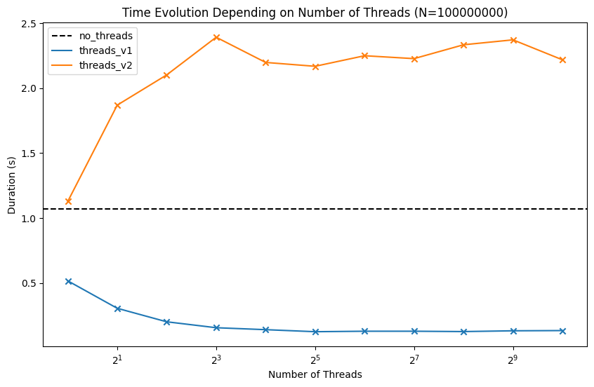

# Threads analysis for dot product (sum after multiply)

## 1) All data is in memory

Implemented variants:
- no threads
- threads v1: sum and product inside fixed number of threads
- threads v2: only product inside fixed number of threads
- TODO: threads v3: thread pool and chunk size

|    | Method     |   ThreadsNumber |   Duration(s) |   ArraySize |    TotalSum |
|---:|:-----------|----------------:|--------------:|------------:|------------:|
|  0 | no_threads |               1 |      1.069    |       100M | 1.03661e+07 |
|  1 | threads_v1 |               1 |      0.516333 |       100M | 1.03661e+07 |
|  2 | threads_v1 |               2 |      0.305    |       100M | 1.03661e+07 |
|  3 | threads_v1 |               4 |      0.201    |       100M | 1.03661e+07 |
|  4 | threads_v1 |               8 |      0.155333 |       100M | 1.03661e+07 |
|  5 | threads_v1 |              16 |      0.140333 |       100M | 1.03661e+07 |
|  6 | threads_v1 |              32 |      0.124667 |       100M | 1.03661e+07 |
|  7 | threads_v1 |              64 |      0.128333 |       100M | 1.03661e+07 |
|  8 | threads_v1 |             128 |      0.128333 |       100M | 1.03661e+07 |
|  9 | threads_v1 |             256 |      0.125667 |       100M | 1.03661e+07 |
| 10 | threads_v1 |             512 |      0.131667 |       100M | 1.03661e+07 |
| 11 | threads_v1 |            1024 |      0.133333 |       100M | 1.03661e+07 |
| 12 | threads_v2 |               1 |      1.12767  |       100M | 1.03661e+07 |
| 13 | threads_v2 |               2 |      1.86933  |       100M | 1.03661e+07 |
| 14 | threads_v2 |               4 |      2.102    |       100M | 1.03661e+07 |
| 15 | threads_v2 |               8 |      2.392    |       100M | 1.03661e+07 |
| 16 | threads_v2 |              16 |      2.198    |       100M | 1.03661e+07 |
| 17 | threads_v2 |              32 |      2.16833  |       100M | 1.03661e+07 |
| 18 | threads_v2 |              64 |      2.24967  |       100M | 1.03661e+07 |
| 19 | threads_v2 |             128 |      2.22733  |       100M | 1.03661e+07 |
| 20 | threads_v2 |             256 |      2.334    |       100M | 1.03661e+07 |
| 21 | threads_v2 |             512 |      2.372    |       100M | 1.03661e+07 |
| 22 | threads_v2 |            1024 |      2.21833  |       100M | 1.03661e+07 |

